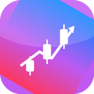

# QuantPilot · 智能交易终端

<p align="center">
  
</p>

<p align="center">
  <b>AI 驱动 · 多市场 · 零依赖离线 PWA + macOS 桌面版</b><br>
  A股 / 港股 / 美股 / 公募基金 / Polymarket 事件市场
</p>

---

## ✨ 功能

| 模块 | 说明 |
|------|------|
| 📈 实时行情 | A股/港股/美股(腾讯行情)、场外基金(天天基金)、Polymarket(官方 Gamma API);离线自动降级缓存/模拟数据 |
| 🕯️ K线图表 | 零依赖 Canvas 引擎:蜡烛+成交量+MA5/20/60+MACD 副图+十字光标,滚轮缩放 |
| 🧪 策略模型 | 10 大内置策略:双均线/MACD/RSI反转/布林突破/海龟/网格/动量轮动/KDJ/多因子/事件驱动 |
| 🧮 因子库 | 35 个量价因子(动量/反转/趋势/波动/量能/摆动/形态/价位),Rank IC 分析 |
| 🧬 自动因子挖掘 | 遗传算法进化因子组合(开关+权重双变异,复杂度惩罚) |
| 🤖 机器学习 | 浏览器内逻辑回归(SGD+L2),35 因子特征,walk-forward 验证,因子重要性 |
| ⏱️ 回测引擎 | A股 T+1/整手/印花税,滑点/佣金,夏普/回撤/Calmar/α 全指标 |
| 🧠 AI Berkshire | 四大师价值分析(巴菲特/芒格/段永平/李录)→ 宏观顾问对抗审核 → 技术择时 → 三情景目标价 + 分层建议 + 证伪条件;可接 Claude/DeepSeek 深度研究 |
| 💼 模拟交易 | 100 万模拟盘,T+1 规则撮合,持仓/订单管理,一键平仓 |
| 🔌 实盘适配器 | 财通 QMT(miniQMT) / 同花顺(easytrader) Windows 桥接端(`bridge/`),失败自动回落模拟盘 |
| 🔔 实时通知 | 飞书 / 企业微信 / Server酱(微信) / 邮件网关 webhook |
| 🛰️ 自动机器人 | 定时扫描自选池 → 策略信号 → 自动下单 + 推送通知 |
| 🧩 命名空间 API | 全局 `qp.*`(market/factor/strategy/backtest/ml/trade/ai),`types/quantpilot.d.ts` 提供完整 TypeScript 类型与 IDE 补全 |

## 🚀 使用

**网页版(离线 PWA)**:直接访问 GitHub Pages 部署地址,或本地:

```bash
cd app && python3 -m http.server 8080   # 打开 http://localhost:8080
```

浏览器「添加到主屏幕/安装应用」即可离线使用。

**macOS 桌面版(DMG)**:从 [Releases](../../releases) 下载,或推送 `v*` 标签由 GitHub Actions 自动构建:

```bash
git tag v1.0.0 && git push origin v1.0.0
```

**开发者 API**(DevTools 控制台):

```js
const bars = await qp.market.klines('sh600519', 500);
qp.backtest.run(bars, qp.strategy.get('turtle').make({entry: 20, exit: 10}), {tPlus1: true});
qp.factor.mine(bars);                    // 遗传算法因子挖掘
qp.ai.analyze('sh600519', '贵州茅台', bars); // 四大师分析
```

## ⚠️ A股实盘说明(重要)

Mac/Web 端**没有任何官方券商交易 API**。实盘路径:

1. 向财通证券申请开通 **QMT/miniQMT**(或使用同花顺独立下单程序)
2. 在一台 Windows 机器运行桥接端:`python bridge/qmt_bridge.py` 或 `bridge/ths_bridge.py`
3. 在 app「设置 → 券商接入」填入桥接地址,打开「实盘交易」开关

未配置桥接时,所有订单在本地模拟盘撮合,绝不触碰真实资金。

## 🏗️ 架构

```
app/                  # 零依赖 Web App(纯 ES Modules,无构建步骤)
├── src/engine/       # indicators/factors/strategies/backtest/ml
├── src/data/         # 行情适配器(腾讯/天天基金/Polymarket/模拟)
├── src/trade/        # 模拟撮合 + 券商适配器 + 通知
├── src/ai/           # AI Berkshire 四大师引擎
├── src/ui|pages/     # iOS 风格组件 + Canvas K线 + 六大页面
├── types/            # TypeScript .d.ts(IDE 自动补全)
└── tests/            # node --test 单元测试(11 项)
src-tauri/            # Tauri 2 桌面壳(CI 构建 DMG)
bridge/               # Windows 实盘桥接端(QMT / easytrader)
.github/workflows/    # Pages 部署 + DMG 构建
core|listeners|decision|execution|risk/  # (历史)Python 事件驱动机器人骨架
```

## 📜 免责声明

本项目仅供学习研究,不构成任何投资建议。预测市场与证券交易均有本金损失风险;不同司法辖区对预测市场合规要求不同,请自行确认当地法律。实盘交易前请小额充分验证,风险自负。
